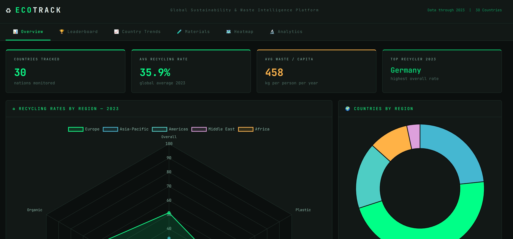

# EcoTrack — Global Sustainability & Waste Intelligence Platform

A full-stack Python library, CLI, and interactive dashboard for scraping, storing, and analyzing recycling and waste management data worldwide.

<p align="center">
  
</p>


---

## Architecture

```
ecotrack/
├── ecotrack/               # Core Python library
│   ├── __init__.py         # Public API
│   ├── db.py               # Database layer (SQLite + DuckDB-style analytics)
│   ├── models.py           # SQLModel-inspired dataclasses
│   ├── scraper.py          # Multi-source web scraper
│   └── analytics.py        # Higher-order analytical computations
├── dashboard/
│   ├── app.py              # Plotly Dash interactive app (requires dash+plotly)
│   └── html_dashboard.py   # Self-contained HTML dashboard generator
├── cli.py                  # Click CLI entry point
└── README.md
```

## Data Sources

| Source | Coverage |
|--------|----------|
| **World Bank Open Data** | Per-capita waste generation, 180+ countries |
| **OECD Environment Stats** | Municipal waste, recycling rates, OECD nations |
| **Eurostat** | EU material flows, packaging waste |
| **Global E-waste Monitor** | E-waste generation & formal recycling rates |
| **UN Environment Programme** | Global waste management outlook |

---

## Quick Start

### 1. Scrape data

```bash
# Scrape all sources (2015–2023)
python cli.py scrape

# Specific year range
python cli.py scrape --years 2018-2023

# Custom database location
python cli.py --db mydata.db scrape
```

### 2. Explore via CLI

```bash
# Database statistics
python cli.py stats

# Recycling leaderboard (latest year)
python cli.py query --year 2023

# Country trend
python cli.py query --country DEU

# Custom SQL
python cli.py query "SELECT country_code, year, overall_rate FROM recycling_rates ORDER BY overall_rate DESC LIMIT 10"

# Analytics reports
python cli.py analyze --report efficiency   # Composite efficiency scores
python cli.py analyze --report improvers    # Top improving countries
python cli.py analyze --report circular     # Circular economy index
python cli.py analyze --report materials    # Global material composition
```

### 3. Export data

```bash
python cli.py export --out ./csv_exports
# Produces: country_profiles.csv, waste_metrics.csv, recycling_rates.csv,
#           material_flows.csv, data_sources.csv, scrape_log.csv
```

### 4. Launch Dashboard

```bash
# Generate self-contained HTML dashboard (no additional deps needed)
python dashboard/html_dashboard.py

# Launch Plotly Dash app (requires: pip install dash plotly)
python cli.py dashboard --port 8050
# OR
python dashboard/app.py
```

---

## Library API

```python
from ecotrack import Database, EcoScraper, Analytics

# Connect (creates DB if not exists)
db = Database("myproject.db")

# Scrape all sources
scraper = EcoScraper(db)
results = scraper.scrape_all(years=range(2015, 2024))

# Query — returns pandas DataFrames
leaderboard = db.get_recycling_leaderboard(year=2023)
trends      = db.get_waste_trend("DEU")
materials   = db.get_material_breakdown(year=2023)
countries   = db.get_countries()

# Run arbitrary SQL (DuckDB-style)
df = db.query_df("""
    SELECT country_code, year,
           ROUND(AVG(overall_rate) OVER (PARTITION BY country_code), 2) as rolling_avg
    FROM recycling_rates ORDER BY country_code, year
""")

# Analytics
ana = Analytics(db)
scores    = ana.recycling_efficiency_score(2023)
improvers = ana.top_improvers(n=10)
circular  = ana.circular_economy_index(2023)
mat_comp  = ana.material_composition_global(2023)

db.close()
```

---

## Dashboard Features

| Tab | Visualisations |
|-----|---------------|
| **Overview** | KPI cards, region radar, country donut, material generation bar, top improvers table |
| **Leaderboard** | Year-selector, sortable table with medals, horizontal bar chart |
| **Country Trends** | Dual-panel: waste time series + recycling rate lines |
| **Materials** | Per-material recycling rates by country + fate donut |
| **Heatmap** | Country × material colour-coded rate grid |
| **Analytics** | Efficiency scores, GDP vs waste scatter, global trend bands |

---

## Data Model

```
country_profiles   — 30 countries, region, population, GDP
waste_metrics      — annual kg/capita, MSW, industrial, e-waste, food waste
recycling_rates    — overall + per-material rates (plastic/paper/glass/metal/organic/e-waste)
material_flows     — generated/recycled/landfilled/incinerated/composted by material
data_sources       — provenance tracking
scrape_log         — audit trail of all scrape runs
```
